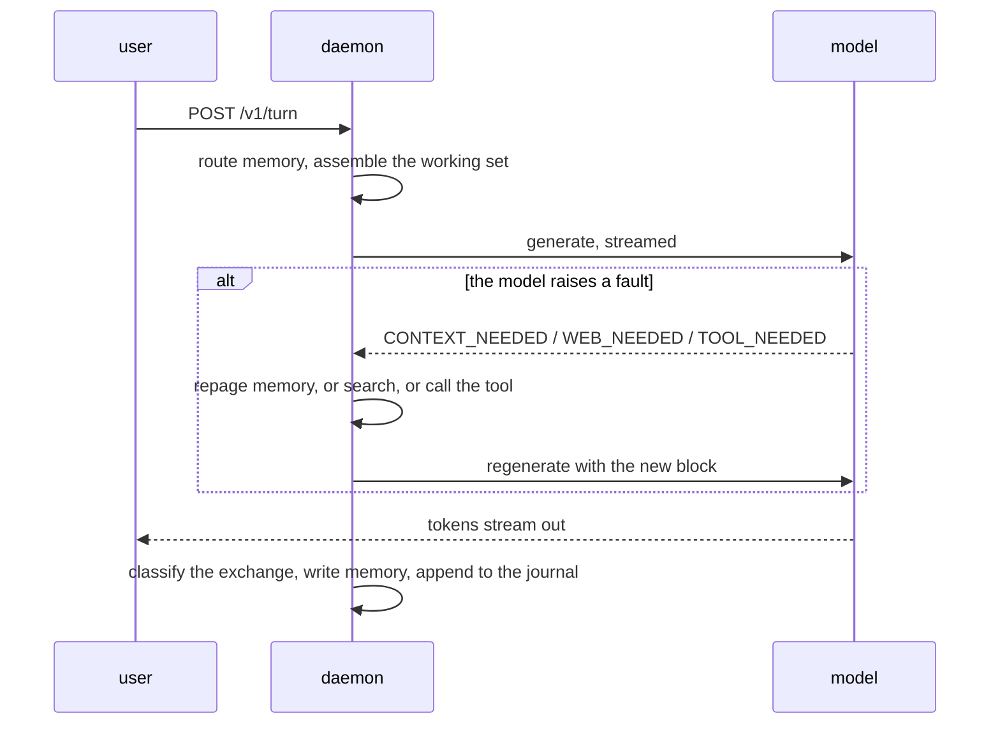
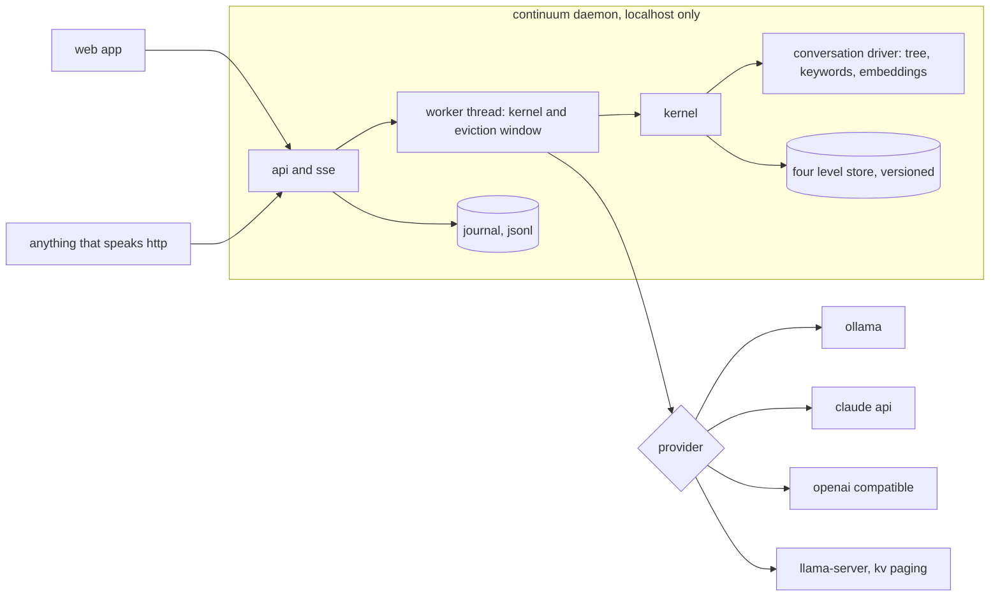

# continuum: architecture & how-to

Reference documentation: how a turn flows, the daemon/app shape, and how to run the benchmarks, the fine tune, and the KV experiments. The project pitch and measured results are in [README.md](README.md); the full research log is in [FINDINGS.md](FINDINGS.md).

## How a turn works



The fault idea generalizes past memory. `CONTEXT_NEEDED` asks the kernel for a different slice of the past. `WEB_NEEDED: <query>` asks the daemon to search (Brave if a key is on file, a keyless DuckDuckGo fallback otherwise). `TOOL_NEEDED: <server.tool> <json>` calls a tool from any MCP server declared in `~/.continuum/mcp.json`. In every case the daemon intercepts the line before the user sees it, does the work, hands the result back as context, and the model answers for real.

The memory budget for a turn is what is left of the window after overhead and the recent session:

$$B = \max\Big(200,\ N_{ctx} - T_{overhead} - T_{reply} - \sum_{m \in S_6} |m|/4\Big)$$

where $S_6$ is the last six session messages and $|m|/4$ is the usual four characters per token guess.

Candidate messages come in broad (tree beam plus keyword hits plus their neighbors), then get reranked and cut hard. Each candidate $i$ scores

$$s_i = \hat{b}_i + \frac{0.3}{1 + r_i} + \cos(q, e_i)$$

with $\hat{b}_i$ the keyword score normalized to the top hit, $r_i$ the rank of the topic leaf that produced it, and the cosine term present when embeddings exist. The top 30 by $s_i$ are loaded in chronological order. The cap is the single most important number in the system; the ablation table below shows what happens without it.

When the session window fills, the most evictable slot goes first:

$$v_x = \frac{t - t_{last}}{60} - 5\,a_x + \tau_x + \beta_x$$

staleness in minutes, minus five per access, $\tau_x$ is +20 off topic or -10 on topic, and $\beta_x$ makes raw messages go before details and details before summaries. Identity and pinned slots never evict. Eviction is demotion: evicted messages land in the store's archive, not the trash.
## The daemon and the app

The prototype server grew into the real shape: a long lived localhost daemon that owns the kernel, the versioned store, and an append only journal under `~/.continuum/`, plus a React frontend that is a thin client of it. One user, one timeline, one memory. There are no sessions anywhere in the API or the UI, and existing `companion/` state is adopted on first boot.



One worker thread owns the kernel as an actor: requests in over a channel, events out per turn, so a slow generation never blocks the status endpoint and cancellation works. The journal is the timeline's source of truth and is never used for retrieval; the drivers do retrieval.


The memory browser shows what it believes about you, topic by topic. Every value keeps its history (the store is copy on write), every fact links back to the turn that formed it, corrections write a new version, and deletion is the one true delete. Memory formation is classified locally by default, whichever model answers; a settings toggle hands classification to the answer model instead, which is sharper but means the exchange leaves the machine twice.

Models are swappable mid conversation from a header menu: hosted Claude models gated on whether a key is on file, any OpenAI compatible endpoint, and whatever Ollama has pulled. Continuity survives the swap because memory never lived in the model. The KV cache tier does not survive it and quietly rebuilds.

Privacy modes are enforced in the daemon, not the frontend. Persistent remembers everything. Incognito talks, writes nothing, and its journal entries are purged on exit. Paused recalls freely and writes nothing. Turns can carry images, stored under `~/.continuum/media/` and passed to whichever provider can see them; a text only model says it cannot see the image instead of erroring. The app does voice in both directions with no cloud: browser speech recognition in, system speech synthesis out.

There is also a landing page and a thesis page, because the argument matters as much as the code:


## Running the benchmarks

Generate predictions for one conversation, or all ten:

```
./target/release/eval --conv 0 --limit 999 --no-judge --jsonl fullbench/aios_conv0.jsonl
./target/release/eval --conv 0 --adv-only --jsonl fullbench/aios_adv0.jsonl

for i in 0 1 2 3 4 5 6 7 8 9; do
  ./target/release/eval --conv $i --limit 999 --no-judge --jsonl fullbench/aios_conv$i.jsonl
  ./target/release/eval --conv $i --adv-only --jsonl fullbench/aios_adv$i.jsonl
done
```

Grade them. Put an API key in `.env` (either `ANTHROPIC_API_KEY=...` or `OPENAI_API_KEY=...`, the script picks whichever exists). Grading all ten conversations cost me under two dollars.

```
python3 judge_frontier.py "fullbench/aios_conv*.jsonl" "fullbench/aios_adv*.jsonl"
```

The no memory baseline:

```
python3 contamination_gen.py
python3 judge_frontier.py fullbench/contamination_conv0.jsonl
```

The mem0 comparison. Ingestion is slow, hours on my machine:

```
python3 -m venv .venv && .venv/bin/pip install mem0ai ollama fastembed
.venv/bin/python mem0_bench.py
python3 judge_frontier.py "fullbench/mem0_conv?.jsonl"
```
## The fine tune

```
.venv/bin/pip install mlx-lm "transformers==4.56.2"
python3 gen_training_data.py     # writes ft_data/ from conversations 1-9

.venv/bin/python -m mlx_lm lora --train \
  --model mlx-community/Meta-Llama-3.1-8B-Instruct-4bit \
  --data ft_data --batch-size 2 --iters 800 --num-layers 16 \
  --max-seq-length 3400 --grad-checkpoint --learning-rate 1e-5 \
  --adapter-path adapters --save-every 200

.venv/bin/python -m mlx_lm fuse \
  --model mlx-community/Meta-Llama-3.1-8B-Instruct-4bit \
  --adapter-path adapters --save-path fused --dequantize

# convert fused/ to GGUF with llama.cpp's convert_hf_to_gguf.py, then:
ollama create aios-ft -f Modelfile    # FROM ./your.gguf
./target/release/eval --conv 0 --limit 999 --model aios-ft --judge-model llama3.1:8b
```

Training took my machine about 12 hours per round because it throttles. A rented GPU would do it in under an hour.
## The KV experiments

Prefill is 97 to 99% of query latency here, and llama.cpp can save per sequence KV state to disk and shift RoPE positions of cached tokens. That means a memory block can be encoded once at position zero, saved, and later restored at any offset and stitched next to other blocks without re reading the text. It works: the model answered correctly from a block that had been shifted 30 positions. There is also a harness that runs a fake coding session where the codebase is five times the context window, and the planted facts survive while questions about absent code get refused. I wrote that codebase and those questions myself, so treat it as a demo rather than an evaluation. KV state files are model locked at about 125 KB per token; text stays the source of truth and KV is a cache tier, never the store.

These use llama.cpp through FFI, so the first build takes a couple of minutes.

```
BLOB=<path to a llama 3.1 gguf, the ollama blob works>
cargo run --release -p kvpoc --bin kvpoc -- $BLOB          # encode two blocks, shift one, stitch, query
cargo run --release -p kvpoc --bin cacheblend -- $BLOB data/conv_0.json   # stitched vs monolithic answers
cargo run --release -p kvpoc --bin codesession -- $BLOB    # fake coding session, codebase 5x the window
```

A known cosmetic issue: the kvpoc binaries hit a Metal assert inside llama.cpp during process exit, after results are printed. Upstream PR 17869.
## Layout

```
src/kernel.rs        page fault loop, context assembly, write back
src/driver.rs        the driver trait and the tree node type
src/hierarchical.rs  conversation driver: tree + BM25 + embeddings, online ingestion, date resolver
src/codegraph.rs     code driver: symbol extraction + BM25, no embeddings
src/store.rs         four level versioned store
src/eviction.rs      context window eviction and demotion
src/llamaserver.rs   llama-server client for KV save/restore
src/server.rs        the original single file companion (continuum serve)
src/bin/eval.rs      LoCoMo runner
src/bin/stress.rs    all ten conversations merged into one store
src/bin/transfer.rs  fine tuned model on code questions it never trained on
kvpoc/               KV cache proofs of concept
daemon/              continuumd: worker actor, journal, providers, web search, mcp client
app/                 React frontend: timeline, memory browser, landing, thesis
shots/               the screenshots above
DESIGN.md            the product spec the daemon and app were built from
```

Not done: a latency comparison against warm prefix caching, and a test on a real repository instead of a synthetic one.
