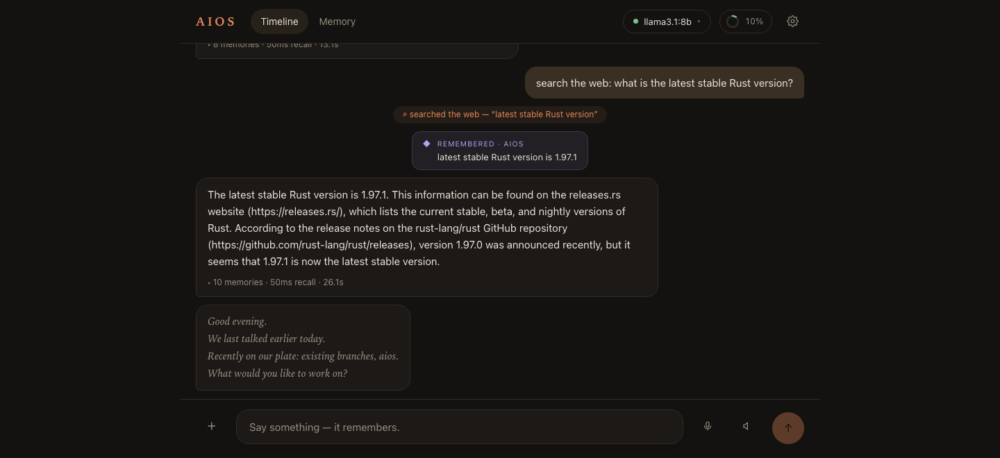
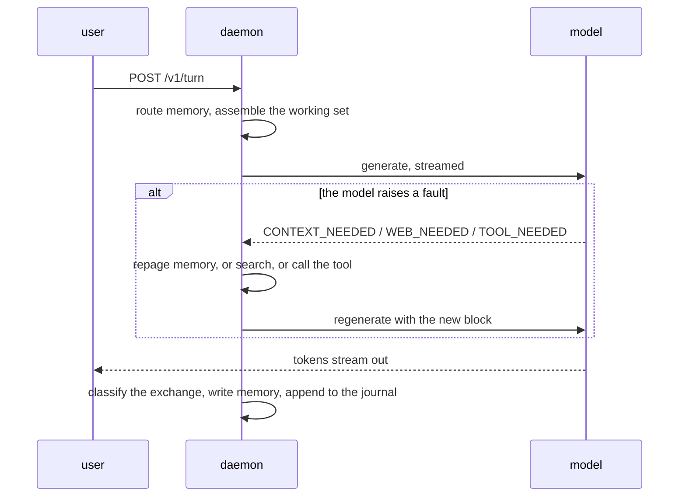
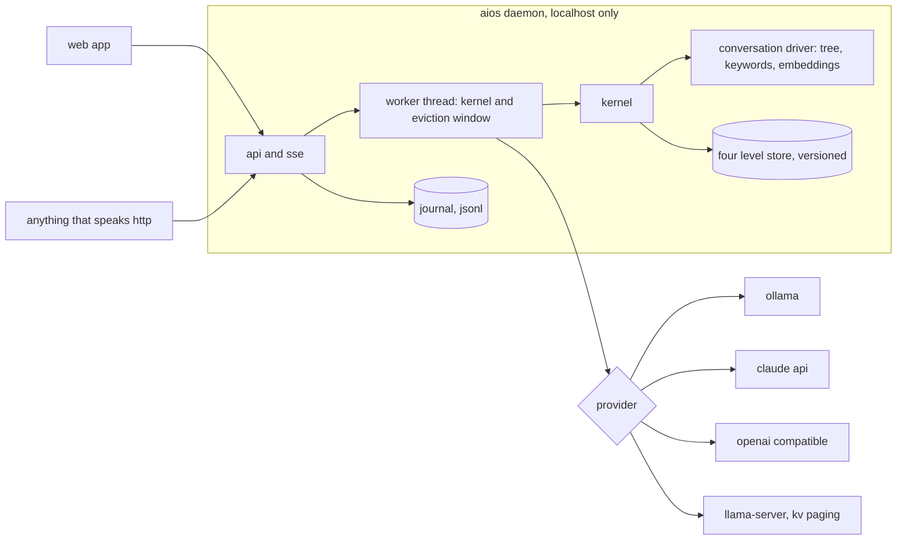
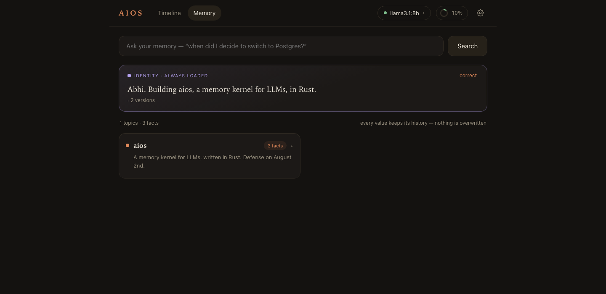
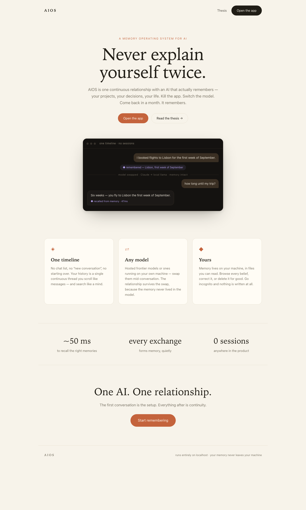

# aios

An experiment in giving a local LLM long term memory by treating the context window like RAM. A small Rust kernel decides what gets paged into the window for each query, the model is trained to reply `CONTEXT_NEEDED: <topic>` when the loaded memory does not answer the question, and everything lives on disk in a versioned store so old facts get demoted rather than deleted.

It grew into an application: a daemon that owns the memory, and a web app in front of it with one timeline and no sessions. Kill the process, switch the model, come back a month later. It remembers.



The whole thing runs on one MacBook (M5, 24GB). Everything from embeddings to the fine tune runs locally through Ollama and MLX. I spent about five dollars total on cloud, all of it on Claude API calls to grade benchmark answers.

I make no claims beyond the numbers below, which come from one benchmark on one machine. Read the caveats before quoting anything.

## How this was built

I started from an older Python prototype and a short spec. The port to Rust gave me a four level store (identity, topic summaries, details, raw archive) where every value keeps its version history, and a kernel/driver split where the kernel is domain agnostic and each driver owns retrieval for one kind of memory. There is a conversation driver and a code driver.

Retrieval took the longest to get right. The first version walked a topic tree down a single path and missed most things. Beam search over the tree helped. Adding BM25 alongside embeddings helped recall but made answers worse, and it took me a while to see why: I was loading around 100 messages per query and the 8B model would miss facts that were sitting in plain sight in its own context. Capping the load at 30 messages, reranked and then presented in chronological order, fixed accuracy and halved latency at the same time.

Dates were the worst question category. LoCoMo gold answers look like "the week before 27 June 2023" and a small model is bad at calendar math. So the code resolves phrases like "last week" or "yesterday" against the timestamp of the message that said them, in plain Rust, and injects the resolved date as a note. That category went from 62% to 81% on my local judge.

The fine tune came from the benchmark itself. Conversations 1 through 9 supplied synthetic training examples of three kinds: evidence loaded so answer it, evidence withheld so say CONTEXT_NEEDED, and a trap loaded (a question about the wrong person) so still say CONTEXT_NEEDED. Conversation 0 was held out and never used for training. QLoRA on llama 3.1 8B through MLX, overnight on the laptop. The first round refused too much. The second round changed the mix and paired every trap with a question the same context could answer. The share of refusal examples in the training data acts like a dial for how conservative the model is.

Two things about evaluation that I got wrong at first and had to fix. I was grading answers with the same 8B model that produced them, and when I re graded with Claude Haiku the score dropped 19 points. Every number below is from the external judge. And I worried the base model might know this public dataset from pretraining, so I asked it the conv 0 questions with no memory attached. It scored 1.3%, which is guessing.

## How a turn works



The fault idea generalizes past memory. `CONTEXT_NEEDED` asks the kernel for a different slice of the past. `WEB_NEEDED: <query>` asks the daemon to search (Brave if a key is on file, a keyless DuckDuckGo fallback otherwise). `TOOL_NEEDED: <server.tool> <json>` calls a tool from any MCP server declared in `~/.aios/mcp.json`. In every case the daemon intercepts the line before the user sees it, does the work, hands the result back as context, and the model answers for real.

The memory budget for a turn is what is left of the window after overhead and the recent session:

$$B = \max\Big(200,\ N_{ctx} - T_{overhead} - T_{reply} - \sum_{m \in S_6} |m|/4\Big)$$

where $S_6$ is the last six session messages and $|m|/4$ is the usual four characters per token guess.

Candidate messages come in broad (tree beam plus keyword hits plus their neighbors), then get reranked and cut hard. Each candidate $i$ scores

$$s_i = \hat{b}_i + \frac{0.3}{1 + r_i} + \cos(q, e_i)$$

with $\hat{b}_i$ the keyword score normalized to the top hit, $r_i$ the rank of the topic leaf that produced it, and the cosine term present when embeddings exist. The top 30 by $s_i$ are loaded in chronological order. The cap is the single most important number in the system; the ablation table below shows what happens without it.

When the session window fills, the most evictable slot goes first:

$$v_x = \frac{t - t_{last}}{60} - 5\,a_x + \tau_x + \beta_x$$

staleness in minutes, minus five per access, $\tau_x$ is +20 off topic or -10 on topic, and $\beta_x$ makes raw messages go before details and details before summaries. Identity and pinned slots never evict. Eviction is demotion: evicted messages land in the store's archive, not the trash.

## Numbers

LoCoMo benchmark, 10 conversations, 1542 answerable and 444 unanswerable questions. Same answer model everywhere (llama 3.1 8B), same judge everywhere (claude haiku 4.5). Mem0 is the open source version, run locally with its BM25 extra installed, same protocol.

| system | answerable | refused unanswerable |
|---|---|---|
| no memory attached | 1.3% | |
| mem0 (OSS, local) | 31.0% | 80.5% |
| aios | 54.3% | 41.7% |
| aios + fine tune (conv 0 only) | 55.9% | 55.3% |

The fine tuned row is conv 0 only because the tune trained on the other nine. On that same held out conversation the untuned model gets 48.0% and refuses 25.5%, so the tune helped both numbers.

Caveats that matter. Mem0 reports 62 to 67% in its own publications using stronger answer models, so a good part of any system's headline number is the answer model, not the memory layer. Mem0's high refusal rate here comes partly from retrieving less: a system that finds little says "I don't know" a lot, which looks disciplined on unanswerable questions. Mem0 ingestion also cost 25 minutes to 4 hours per conversation on this hardware since it extracts facts with an LLM, versus about a minute here. The judge is nondeterministic by roughly one question per 150. The KV and coding session results are single digit sample sizes. And all of this is one benchmark.

## The daemon and the app

The prototype server grew into the real shape: a long lived localhost daemon that owns the kernel, the versioned store, and an append only journal under `~/.aios/`, plus a React frontend that is a thin client of it. One user, one timeline, one memory. There are no sessions anywhere in the API or the UI, and existing `companion/` state is adopted on first boot.



One worker thread owns the kernel as an actor: requests in over a channel, events out per turn, so a slow generation never blocks the status endpoint and cancellation works. The journal is the timeline's source of truth and is never used for retrieval; the drivers do retrieval.



The memory browser shows what it believes about you, topic by topic. Every value keeps its history (the store is copy on write), every fact links back to the turn that formed it, corrections write a new version, and deletion is the one true delete. Memory formation is classified locally by default, whichever model answers; a settings toggle hands classification to the answer model instead, which is sharper but means the exchange leaves the machine twice.

Models are swappable mid conversation from a header menu: hosted Claude models gated on whether a key is on file, any OpenAI compatible endpoint, and whatever Ollama has pulled. Continuity survives the swap because memory never lived in the model. The KV cache tier does not survive it and quietly rebuilds.

Privacy modes are enforced in the daemon, not the frontend. Persistent remembers everything. Incognito talks, writes nothing, and its journal entries are purged on exit. Paused recalls freely and writes nothing. Turns can carry images, stored under `~/.aios/media/` and passed to whichever provider can see them; a text only model says it cannot see the image instead of erroring. The app does voice in both directions with no cloud: browser speech recognition in, system speech synthesis out.

There is also a landing page and a thesis page, because the argument matters as much as the code:



## Running it

You need Rust and Ollama with two models pulled.

```
ollama pull llama3.1:8b
ollama pull nomic-embed-text
ollama serve

cargo test                                # unit tests, no network needed
cargo build --release -p aios-daemon
(cd app && npm install && npm run build)  # once, for the UI
./target/release/aios-daemon              # http://localhost:4310
```

Keys, all optional, live in `~/.aios/keys` as one JSON object, chmod 600, never logged, never returned by the API: `anthropic` for Claude, `openai` for OpenAI compatible endpoints, `brave` for real web search. MCP servers go in `~/.aios/mcp.json` and their tools show up on the next daemon start.

The API, localhost JSON with SSE for the turn stream: `POST /v1/turn`, `POST /v1/turn/cancel`, `GET /v1/timeline`, `GET /v1/memory/search`, `GET /v1/memory/browse`, `POST /v1/memory/correct`, `POST /v1/memory/delete`, `GET/PUT /v1/settings`, `GET /v1/status`, `GET /v1/models`, `GET /v1/digest`, `GET /v1/media/<file>`, `POST /v1/kv/*`.

The older single file companion still works if you want the minimal version:

```
./target/release/aios serve --model llama3.1:8b     # http://localhost:3210
```

For the benchmark CLI, get locomo10.json from the snap-research/locomo repo on GitHub, put it at data/locomo10.json, then:

```
./target/release/aios ask "When did Caroline go to the LGBTQ support group?"
./target/release/aios chat
```

Chat with KV persistence (attention states saved to disk on exit, restored on start). Needs llama-server, which reads GGUF straight out of the Ollama blob store:

```
brew install llama.cpp
BLOB=~/.ollama/models/blobs/$(ollama show llama3.1:8b --modelfile | grep -o 'sha256[^ ]*' | head -1 | tr : -)
mkdir -p kv_slots
llama-server -m $BLOB --port 8080 -c 8192 --slots --slot-save-path $PWD/kv_slots -np 1 &
./target/release/aios chat --kv
```

## Ablations, other models, a second benchmark

Removing one retrieval component at a time (conversation 0, base llama 3.1,
ROUGE-L, same 154 questions):

| configuration | ROUGE-L | page faults |
|---|---|---|
| full pipeline | 0.449 | 14 |
| without tree routing | 0.455 | 12 |
| without dense embeddings | 0.442 | 16 |
| without the date resolver | 0.424 | 13 |
| without BM25 | 0.265 | 66 |
| without the 30 message cap | 0.118 | 1 |

The cap and BM25 carry the system. Removing the cap reproduces the failure
that shaped the design: the model reads a hundred loosely relevant messages,
answers wrongly with confidence, and generation time doubles. The tree adds
nothing on this benchmark; its case is browsing and scale, not QA, and I keep
it because the online ingestion path builds it for free.

Same stack, different answer models, same questions, graded by claude haiku:
llama 3.1 8b 48.0%, mistral 7b 45.4%, phi3 mini 50.0%. Three model families
land in the same band on the identical stack. ROUGE had suggested phi3 was
far worse (0.215 against llama's 0.449); the judge shows it is just verbose,
not wrong. Refusal discipline is where models differ wildly: llama refuses
25.5% of unanswerable questions, mistral 28.9%, phi3 almost never (2.2%),
which is the behavior the fine tune exists to install.

I also tried a second retrieval hop: mine the first round's results for
names the query did not contain, search again on those, merge at a discount.
It moved the chained fact tasks a little (qa2 went 0/20 to 4/20) but cost
more than it paid: qa1 dropped 13/20 to 8/20 from the added noise and
latency doubled. It ships default off behind a flag. The honest conclusion
is that blind expansion is the wrong shape for multi hop here; the kernel
already has a targeted mechanism (the model faults, the kernel re-pages on
the fault topic) and that is the direction worth pursuing.

I tested whether the fine tuned model would trigger that mechanism on the
chained tasks. It does not: zero faults fired, because the loaded chunks
look topical even when the reasoning chain through them is incomplete. The
tune teaches "fault when the topic is missing," not "fault when a chain is
missing a link," and those are different skills. Teaching the second one
needs training examples of exactly that shape, which are easy to generate,
and is the obvious next round if I train again. The tuned model also scored
ten points below base on this benchmark overall; it is better on
conversational memory and worse on book text, so different memory volumes
probably want different answer models, which the driver design happens to
support.

Retrieval cost, measured: 33 to 57 ms at the median against 7 to 14 seconds
of generation. The memory side is about half a percent of a query.

BABILong (facts hidden in 64k tokens of book text, answered through a 4k
window, exact match): qa1 13/20, qa2 0/20, qa3 2/20, qa4 12/20, qa5 20/20.
Single fact tasks work well through sparse retrieval. Chained fact tasks
fail, the same multi hop weakness LoCoMo showed, and the known failure mode
of retrieval systems generally. Fetch the data with `fetch_babilong.py`,
run with `cargo run --release --bin babilong`.

There is an endurance script that hammers the live loop: it plants ten
facts, buries them under a hundred turns of unrelated chatter on the small
fixed window, then asks for them back. 130 turns over 104 minutes, the
window never went over budget, 9 of 10 facts came back (the tenth was a
grader casing bug). `python3 endurance.py <port>` against a running server.

The daemon has its own compaction stress harness. It forces the session
window down to 500 tokens, plants ten facts, buries them under thirty
distractor turns so every planted fact gets demoted out of the window,
contradicts two of them along the way (the dentist moves, the rate limit
drops), then asks for everything back plus two things that were never
said:

```
AIOS_HOME=/tmp/aios-stress ./target/release/aios-daemon --port 4311
python3 stress_daemon.py 4311
```

The harness grades three claims separately, because they are different
claims. Two runs at n of 10 so far, hosted answer model (Nova 2 Lite)
over the local memory stack. The first run scored clean across the board;
the second disagreed with it in both directions, which is exactly why
these stay labeled a smoke test and not a benchmark. The LoCoMo numbers
above are the measured ones.

Never-said probes, and this is the result I care most about. Asked for a
pool locker combination when only a gym one exists, and for a wedding
date never mentioned, run one page faulted both times and answered an
honest "I don't have that". Then, in one of two adversarial trials, the
model answered a question about a locker that was never mentioned by
returning the gym combination with full confidence. I am deliberately not
attaching a ratio to that: a ratio invites averaging, and this is the
confabulation the probe exists to catch, the failure mode that erodes
trust fastest, and the argument for the fault fine-tune in the answer
model rather than a solved problem.

Retrieval survives window churn: 19 of 20 across the two runs, one stale.
The window peaked around 499 of 500 and never went over, about 85
messages per run were demoted to the archive, and facts came back exact
at 32 to 59 ms retrieval. The contradicted facts usually answered with
the new values (October 21st, 90 per minute) but not always: run two
answered the API question with the superseded 120. To be precise about
attribution: in the daemon's flow the store never enters the prompt
(identity aside), so this recall is served by the conversation index that
every turn feeds. The store's runtime jobs are identity, provenance, the
archive, and the browser.

Write-back capture, measured on its own, and split by where the fact
landed, because a fact that only survives inside the identity string has
weaker guarantees than a versioned branch detail. Run one: 3 branch-filed,
4 identity-only, 3 missed. The identity blob had absorbed the locker
combination and the database version as if they were who I am. That
prompted three deterministic kernel fixes: value-bearing facts reroute
from identity to a branch detail, near-duplicate identity merges are
blocked by token overlap, and a detail that narrowly restates a branch
summary supersedes it, so a summary can't keep advertising the dentist's
old date after the details learn the new one (verified in the store:
the summary now versions 14th to 21st with history kept). Run two, with
the fixes: 5 branch-filed, 1 identity-only, 4 missed. The misses that
held across both runs are events involving another person (lending a
book) and corrections phrased as "we lowered X to 90"; the other misses
flip run to run and look like noise. The classifier keeps what sounds
like a profile statement and drops events and corrections, which is
actionable in a way "capture is weak" is not. The harness tags every
planted fact by form and reports branch versus identity placement, so
further runs show whether the pattern holds. Capture is also not what
serves recall today, which is worth knowing before reading these numbers
as failures.

Which raised the question the store had coming: does any of that capture
machinery matter to the thing that ships? I wired query-relevant store
topics (summary plus current fact values) into the prompt behind a
setting, instrumented every answer with how many topics got paged in, and
ran the harness a third time. The answer, on this evidence, is no. Recall
was 10 of 10, but the one question where the store could have earned its
place (the corrected rate limit, which a previous run answered stale) was
paged zero store topics, because the correction was never captured; the
pass came from the driver index having a better day. Only four of ten
questions pulled in any store topic, and all four also had the raw
messages available. One real if narrow win: the dentist question paged in
the superseded summary and answered the new date, which is the case the
stale-summary fix exists for; before that fix this experiment would have
pushed the old date into the prompt. The pool-locker probe leaked again
in this run, its second leak in three trials, with and without the store
block, so the block neither causes nor prevents that. Net: store context
ships default off, the toggle stays, and the store's runtime jobs remain
identity, provenance, the archive, and the browser. If capture gets good
enough to know things the raw history doesn't say plainly, this
experiment is sitting there ready to rerun.

That verdict had a hole in it, though: every fact in the harness lives in
one message, which is the case raw retrieval was never going to lose. So
there are two more instruments. `leak_gauntlet.py` measures near miss
confabulation per answer model: plant a gym locker combination, then ask
about a pool locker, a bike lock, an office locker, and a train time that
were never mentioned, twice each, on a fresh state per model. Nova Pro
leaked 0 of 8. Llama 3.3 70B leaked 1 of 8, but two of its trials were
eaten by rate limits so its denominator is soft. Nova 2 Lite and qwen2.5
14B leaked 2 of 8 each. Every single leak, on every model that leaked,
was the pool locker question specifically; the other three frames never
tempted anyone. The daemon now defaults to the model that never leaked,
and the harder tests below ran on it.

`stress_discriminate.py` plants cases that do not live in one message:
synthesis (the dentist date in one turn, "pushing everything in my
calendar back a week" thirty turns later, phrased to share no keyword
with the question), contradiction chains (an editor changed three times,
a standup time changed twice, every mention keyword-equal to the
question so recency cannot come from lexical luck), and cross topic
composition (a 50 thousand request plan and a 62 thousand usage stated
separately, then "am I over my allowance"). Run twice on the clean
model, store context off and on, fresh state each.

Both conditions scored 4 of 5, and the details matter more than the tie.
Raw retrieval plus an answer model that combines at answer time handled
synthesis in both conditions: the off condition reply literally walked
"originally October 14th, pushed a week, October 21st", and both
contradiction chains resolved to the latest value. "Search cannot
combine" undersells what the answer model does with a well ordered
working set, at least at this transcript size, and that is a real
revision to my expectations, which had the store winning these. And both
conditions failed the same case, the composition one: retrieval surfaced
the usage but not the plan (the question shares keywords with only one
of them), and the store had not captured both facts either, so the block
paged in nothing. Neither architecture can do this today. It is the same
shape as the chained fact weakness LoCoMo and BABILong already showed,
and the fix candidates are the same: fault driven second retrieval, or
capture reliable enough to pre join facts that belong together.

The honest limits: one run per condition, and a 34 turn transcript, which
with a 30 message load cap means retrieval had good odds of surfacing
scattered mentions by volume alone. Whether answer time synthesis
survives a transcript of hundreds of messages is the open question, and
the scale run that answers it needs the harnesses above run dozens of
times per condition, which is hours of model time and the next piece of
work on this thread.


Notes from living with it: write back runs one extra model call per turn,
so replies take a few seconds longer than plain chat. The 8B model
sometimes decorates recalled facts; in one test it added a year to a date I
never gave it. The 8B write back classifier also files things under odd
topic names, which is why the store deduplicates on write and the browser
has correct and delete. A bigger classifier, or handing classification to
the answer model, fixes more of that than prompt tweaks do.

## Running the benchmarks

Generate predictions for one conversation, or all ten:

```
./target/release/eval --conv 0 --limit 999 --no-judge --jsonl fullbench/aios_conv0.jsonl
./target/release/eval --conv 0 --adv-only --jsonl fullbench/aios_adv0.jsonl

for i in 0 1 2 3 4 5 6 7 8 9; do
  ./target/release/eval --conv $i --limit 999 --no-judge --jsonl fullbench/aios_conv$i.jsonl
  ./target/release/eval --conv $i --adv-only --jsonl fullbench/aios_adv$i.jsonl
done
```

Grade them. Put an API key in `.env` (either `ANTHROPIC_API_KEY=...` or `OPENAI_API_KEY=...`, the script picks whichever exists). Grading all ten conversations cost me under two dollars.

```
python3 judge_frontier.py "fullbench/aios_conv*.jsonl" "fullbench/aios_adv*.jsonl"
```

The no memory baseline:

```
python3 contamination_gen.py
python3 judge_frontier.py fullbench/contamination_conv0.jsonl
```

The mem0 comparison. Ingestion is slow, hours on my machine:

```
python3 -m venv .venv && .venv/bin/pip install mem0ai ollama fastembed
.venv/bin/python mem0_bench.py
python3 judge_frontier.py "fullbench/mem0_conv?.jsonl"
```

## The fine tune

```
.venv/bin/pip install mlx-lm "transformers==4.56.2"
python3 gen_training_data.py     # writes ft_data/ from conversations 1-9

.venv/bin/python -m mlx_lm lora --train \
  --model mlx-community/Meta-Llama-3.1-8B-Instruct-4bit \
  --data ft_data --batch-size 2 --iters 800 --num-layers 16 \
  --max-seq-length 3400 --grad-checkpoint --learning-rate 1e-5 \
  --adapter-path adapters --save-every 200

.venv/bin/python -m mlx_lm fuse \
  --model mlx-community/Meta-Llama-3.1-8B-Instruct-4bit \
  --adapter-path adapters --save-path fused --dequantize

# convert fused/ to GGUF with llama.cpp's convert_hf_to_gguf.py, then:
ollama create aios-ft -f Modelfile    # FROM ./your.gguf
./target/release/eval --conv 0 --limit 999 --model aios-ft --judge-model llama3.1:8b
```

Training took my machine about 12 hours per round because it throttles. A rented GPU would do it in under an hour.

## The KV experiments

Prefill is 97 to 99% of query latency here, and llama.cpp can save per sequence KV state to disk and shift RoPE positions of cached tokens. That means a memory block can be encoded once at position zero, saved, and later restored at any offset and stitched next to other blocks without re reading the text. It works: the model answered correctly from a block that had been shifted 30 positions. There is also a harness that runs a fake coding session where the codebase is five times the context window, and the planted facts survive while questions about absent code get refused. I wrote that codebase and those questions myself, so treat it as a demo rather than an evaluation. KV state files are model locked at about 125 KB per token; text stays the source of truth and KV is a cache tier, never the store.

These use llama.cpp through FFI, so the first build takes a couple of minutes.

```
BLOB=<path to a llama 3.1 gguf, the ollama blob works>
cargo run --release -p kvpoc --bin kvpoc -- $BLOB          # encode two blocks, shift one, stitch, query
cargo run --release -p kvpoc --bin cacheblend -- $BLOB data/conv_0.json   # stitched vs monolithic answers
cargo run --release -p kvpoc --bin codesession -- $BLOB    # fake coding session, codebase 5x the window
```

A known cosmetic issue: the kvpoc binaries hit a Metal assert inside llama.cpp during process exit, after results are printed. Upstream PR 17869.

## Layout

```
src/kernel.rs        page fault loop, context assembly, write back
src/driver.rs        the driver trait and the tree node type
src/hierarchical.rs  conversation driver: tree + BM25 + embeddings, online ingestion, date resolver
src/codegraph.rs     code driver: symbol extraction + BM25, no embeddings
src/store.rs         four level versioned store
src/eviction.rs      context window eviction and demotion
src/llamaserver.rs   llama-server client for KV save/restore
src/server.rs        the original single file companion (aios serve)
src/bin/eval.rs      LoCoMo runner
src/bin/stress.rs    all ten conversations merged into one store
src/bin/transfer.rs  fine tuned model on code questions it never trained on
kvpoc/               KV cache proofs of concept
daemon/              aios-daemon: worker actor, journal, providers, web search, mcp client
app/                 React frontend: timeline, memory browser, landing, thesis
shots/               the screenshots above
DESIGN.md            the product spec the daemon and app were built from
```

Not done: a latency comparison against warm prefix caching, and a test on a real repository instead of a synthetic one.
